# 智慧农业环境监控平台 — 交互流程分析

| 项目 | 内容 |
| --- | --- |
| 文档名称 | 智慧农业环境监控平台交互流程分析 |
| 文档版本 | v1.0（基于需求清单 v2.0） |
| 编写日期 | 2026-09-09 |
| 文档状态 | 基线版，对需求清单 v2.0 的用例与模块做动态交互刻画 |
| 关联文档 | `需求清单2.0.md`（用例/模块基线）、`需求清单1.0.md`、`数据库定义文档.md`、`产品与物模型CRUD接口文档.md` |

---

## 1. 文档说明

需求清单 v2.0 已完成**行为视角（第 5 节用例）**与**结构视角（第 6 节模块）**分析。本文档从**动态视角**补全第三层：各类角色与系统、系统各模块之间在典型业务场景下的**消息时序、数据流向与异常处理**，支撑后续详细设计与接口/状态机设计。

本文不再重复用例规约与模块职责，而是以**时序图 + 说明**的形式回答"一次操作在系统内部是怎么流动的"。

### 1.1 参与者与图例约定

| 符号 | 含义 |
| --- | --- |
| `参与者` | 人角色（种植户 / 观察员 / 管理员）或外部系统（设备 env_ctrl） |
| `前端` | Vue3 + ECharts 前端，经 REST / WebSocket 与后端交互 |
| `M0–M9` | 需求清单 v2.0 第 6 节定义的 10 个后端模块 |
| `MySQL` / `InfluxDB` / `Redis` / `EMQX` | 外部存储 / 消息中间件 |
| `->>` | 同步请求 / 消息 |
| `-->>` | 响应 / 回执 |
| `Note` | 说明、异常分支或落库动作 |

> 图例中的 `EMQX` 属于 M0 接入与基础设施；`MySQL/InfluxDB/Redis` 由 M0 统一封装访问。

### 1.2 交互流程索引

| 流程编号 | 流程名称 | 主要参与者 | 涉及模块 | 对应用例 |
| --- | --- | --- | --- | --- |
| IF-01 | 认证与授权 | 种植户/观察员/管理员 | M1、M9 | UC-G2、UC-O1、UC-A1 |
| IF-02 | 产品与物模型定义 | 管理员 | M2、M3 | UC-A2、UC-A3 |
| IF-03 | 设备接入与属性上报 | 设备 env_ctrl | M0、M4、M5 | UC-D1、UC-D2 |
| IF-04 | 设备控制闭环 | 种植户、设备 | M6、M3、M0 | UC-G5、UC-D3 |
| IF-05 | 告警阈值配置与下发 | 种植户、设备 | M3、M8、M0 | UC-G6、UC-D4 |
| IF-06 | 时序数据存储与查询 | 前端、设备 | M5、M0、M7 | UC-G3、UC-G4 |
| IF-07 | 告警触发与记录 | 设备 / 平台 | M8、M5、M3 | UC-D5、UC-G7 |
| IF-08 | 权限拦截与行级隔离 | 观察员 | M9、M1 | UC-O2、UC-G8 |
| IF-09 | 异常与边界交互 | 设备 | M0、M4、M6 | — |

---

## 2. 认证与授权流程（IF-01）

登录是几乎所有后续流程的前置。本流程刻画"登录获取 JWT → 访问受保护接口 → 刷新令牌"三阶段。

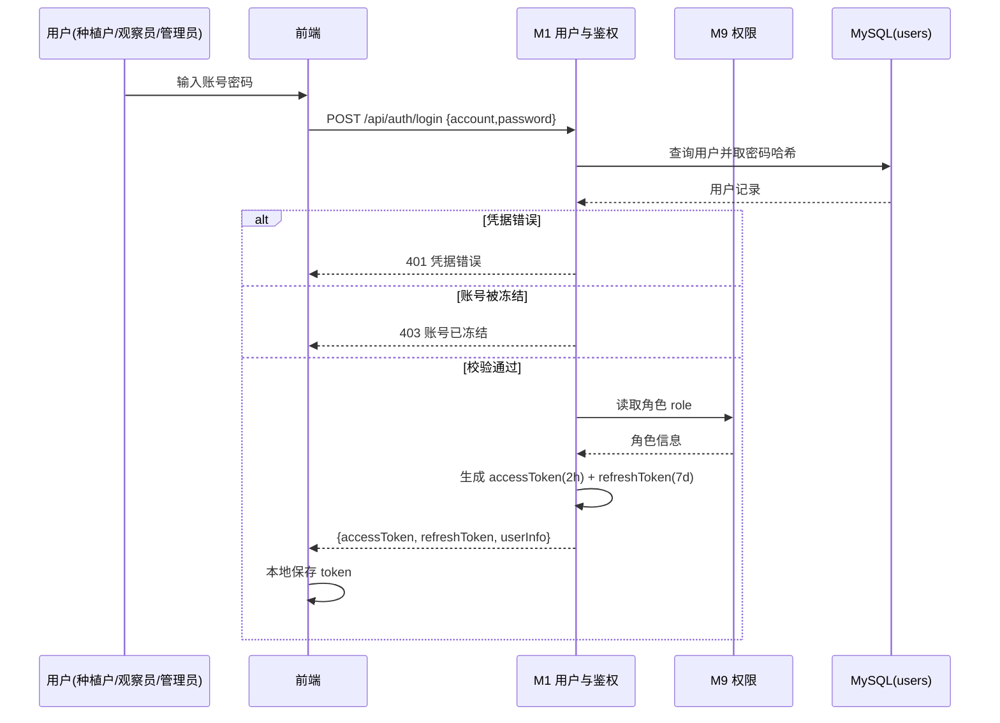

受保护接口访问与刷新（令牌续期）：

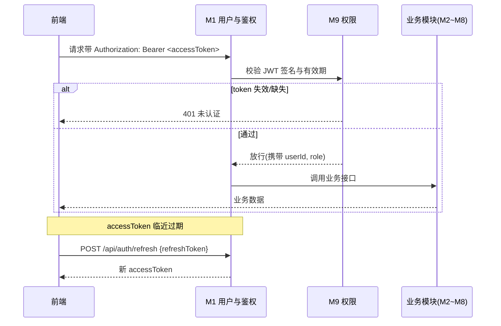

**要点**
- 角色在登录时由 M9 读取，注入 JWT `claims`，后续每个请求由 M9 中间件校验，无需每次查库（Redis 可缓存黑名单）。
- 本流程当前已落地 F1（注册/登录/JWT 签发），但 **M9 角色拦截尚未实现**（v2.0 实现状态：F9 ⬜），故"放行"目前不含角色判定。

---

## 3. 产品与物模型定义流程（IF-02）

管理员先建产品，再为产品定义物模型。本流程强调 **JSON 与关系表双写一致**（数据模型决策 10.1）。

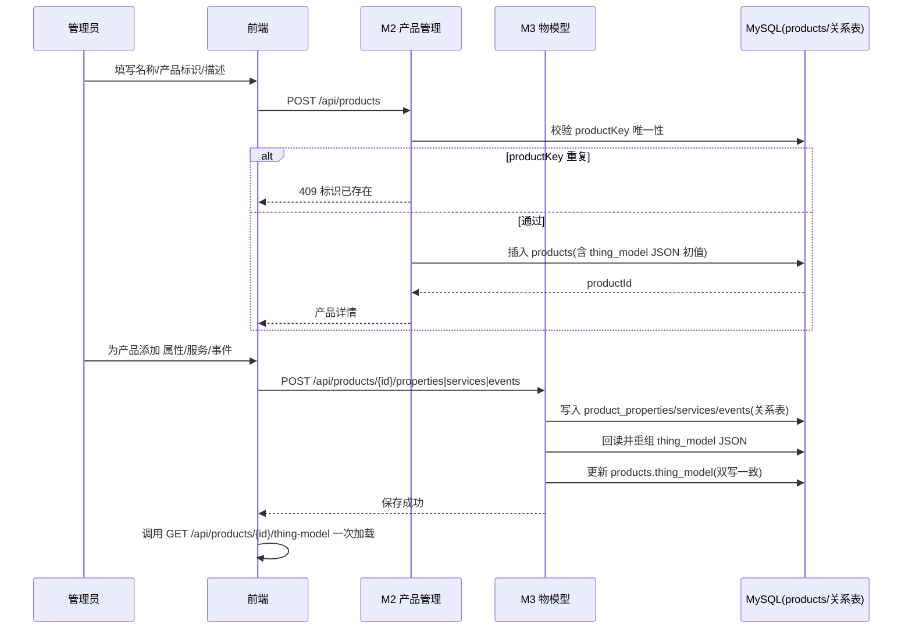

**要点**
- 物模型聚合接口 `GET /api/products/{id}/thing-model` 直接返回 `thing_model` JSON，前端**一次加载**完整模型（满足 F3 设计目标）。
- 双写一致性风险：若关系表与 JSON 更新不一致，前端展示与运维查询会出现分歧。建议 v2.0 风险项"6. 物模型双写一致性"在详细设计中封装为统一服务层。

---

## 4. 设备接入与属性上报流程（IF-03）

设备侧经 MQTT 与平台交互。区分两类交互：**平台感知的上/下线事件**与**设备主动上报的属性**。

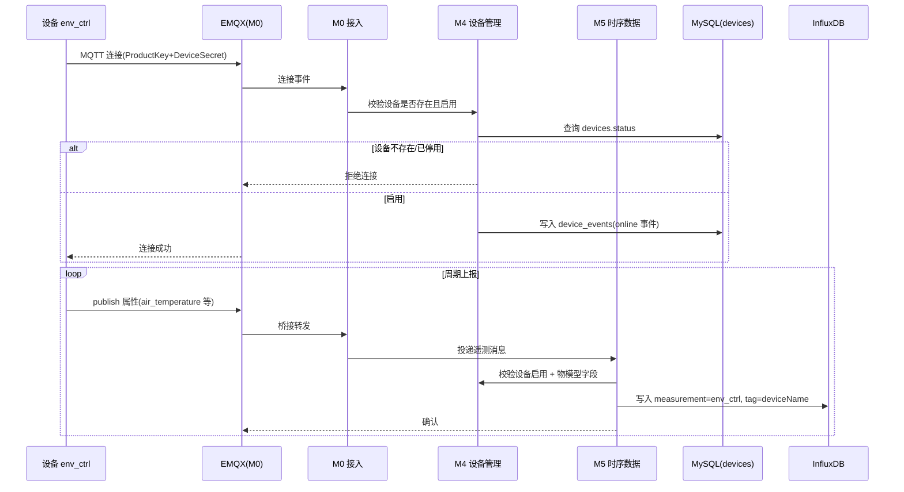

**要点**
- 设备身份由 `ProductKey + DeviceName` 唯一标识，连接时校验 `DeviceSecret`（仅注册时明文一次，见 UC-G9）。
- 只读属性（air_temperature 等）走此上报路径；读写型阈值（temp_threshold 等）不在上报流，而由 IF-05 下发（设备本地存储）。
- 当前 F4/F5 接口未实现，表中 `devices`/`device_events` 已建，历史曲线查询依赖 InfluxDB 落地后才可用（v2.0 状态：F5 ⬜）。

---

## 5. 设备控制闭环流程（IF-04）

平台→设备的"服务"调用，需**下发与回执闭环**，关键在 `messageId` 关联与超时处理（对应 UC-G5）。

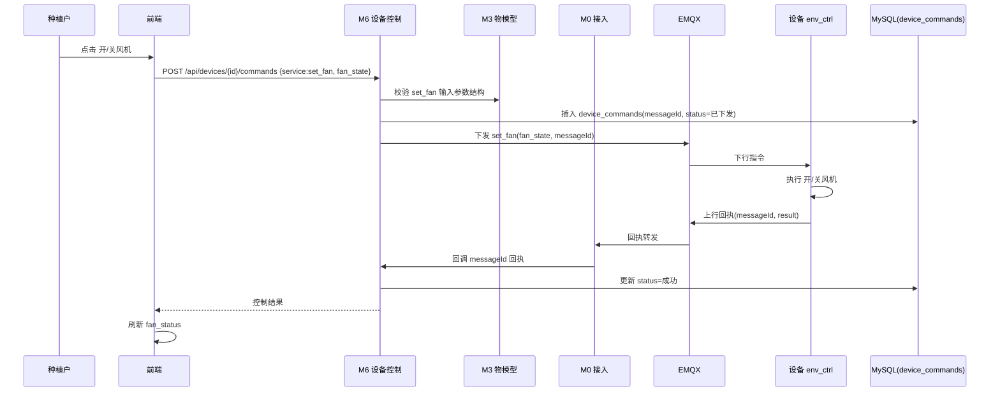

异常分支（回执超时/设备离线）：

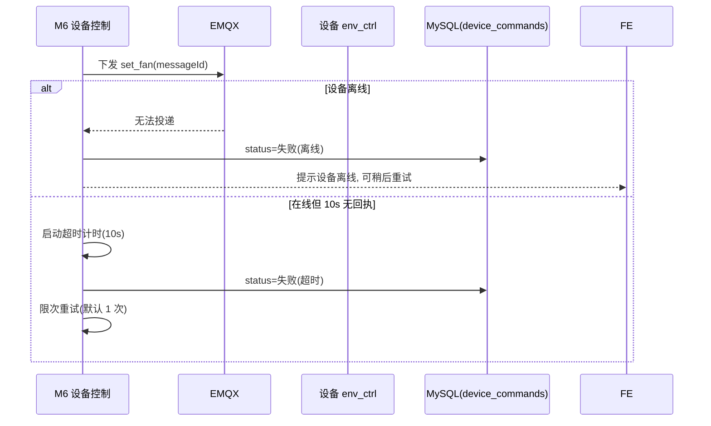

**要点**
- `messageId` 全局唯一，贯穿"下发→回执"，是控制闭环的关联键（F6 业务规则）。
- 仅**启用**设备可接收指令（M4 状态校验）。
- 设备端 `fan_status` 属只读属性，执行后会在下一次属性上报（IF-03）中回传，前端据此刷新开关状态。

---

## 6. 告警阈值配置与下发流程（IF-05）

种植户设定温/湿度告警阈值：既持久化到平台，又下发设备**本地存储**（满足 P-04"断网也能本地判断"）。

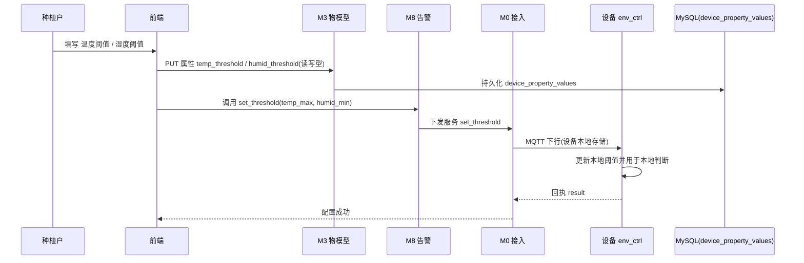

**要点**
- 阈值有两条去向：① 平台 `device_property_values`（可被 `alarm_rules` 规则引用，IF-07 平台侧评估）；② 设备本地存储（断网时由设备端 `temp_alarm`/`dry_alarm` 事件直接判断，IF-07 设备侧触发）。
- 若设备离线，下发可标记为"待同步"，设备上线（IF-03 online）后补发。

---

## 7. 时序数据存储与查询流程（IF-06）

分三路：实时上报入库（接 IF-03）、历史查询、实时推送（WebSocket）。

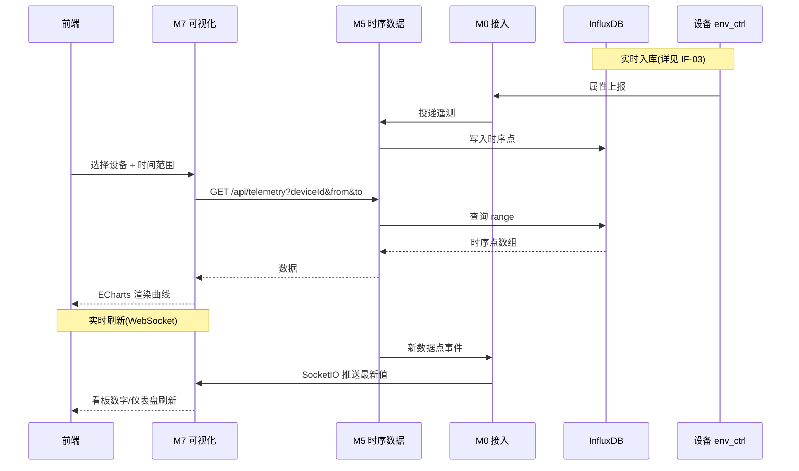

**要点**
- 实时数据优先走 WebSocket（SocketIO），降低轮询压力；历史走 REST 查询 InfluxDB。
- 查询性能目标：近 24h 查询 < 1s（非功能性需求 11）。

---

## 8. 告警触发与记录流程（IF-07）

告警存在**两类触发源**，均落 `device_events`：

1. **设备端触发**：设备按本地阈值判断后上报 `temp_alarm` / `dry_alarm`（断网也能触发，声光报警）。
2. **平台端触发**：平台依据 `alarm_rules` 规则引擎评估实时/入库数据，越限时生成告警。

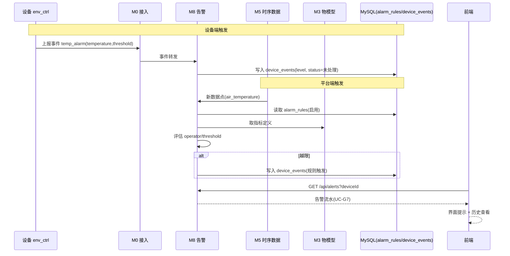

**要点**
- 规则表 `alarm_rules` 与触发流水 `device_events` 解耦（数据模型决策 10.2）：规则是"配置"，流水是"发生过的事件"。
- 当前状态：F8 规则表与示例已建（air_temperature>35、soil_humidity<20），**触发引擎未实现**（v2.0 状态：F8 🟡）。
- 告警动作初版为"记录+界面提示"，短信/邮件/微信待确认（风险项 5）。

---

## 9. 权限拦截与行级隔离流程（IF-08）

观察员登录后只能看被授权数据、无任何控制入口（满足 O-02）。本流程体现 M9 横切复用。

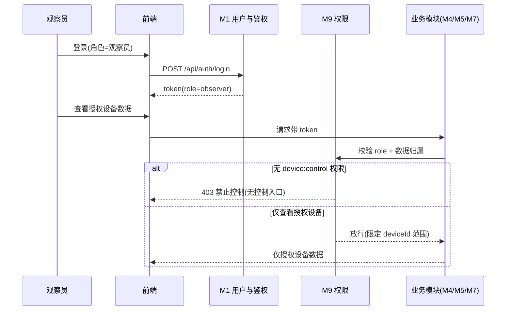

**要点**
- JWT 携带 `userId` 与 `roles`，M9 中间件按"角色 + 行级归属"过滤：种植户只看自己名下设备，观察员只看被授权设备。
- 授权关系（种植户→观察员）对应 UC-G8，需新增**授权关系表**（v2.0 风险项 7），当前未细化。
- 当前 F9 仅 JWT、无角色拦截（v2.0 状态：F9 ⬜），本流程为待实现目标态。

---

## 10. 异常与边界交互（IF-09）

汇总跨流程的异常与补偿机制，避免在主流程图中过度展开。

| 异常场景 | 触发条件 | 处理策略 | 涉及模块 |
| --- | --- | --- | --- |
| 设备离线指令 | 下发时设备未连接 | 标记失败(离线)，界面提示，可手动重试；上线后补发 | M6、M0 |
| 回执超时 | 在线但 10s 无回执 | 标记失败(超时)，限次重试(默认 1 次) | M6 |
| 断网数据补报 | 设备网络中断 | 设备本地缓存遥测，联网后批量补报（断网声光报警仍本地触发） | 设备、M5 |
| 阈值下发离线 | 配置时设备离线 | 标记待同步，online 事件后补发 set_threshold | M3、M8、M0 |
| 重复标识 | productKey / identifier / deviceName 重复 | 返回 409，拒绝写入 | M2、M3、M4 |
| 凭据错误/冻结 | 登录校验失败 | 401 / 403，提示明确原因 | M1 |
| 未认证/越权 | 缺 token 或角色不符 | 401 / 403，中间件统一拦截 | M9 |

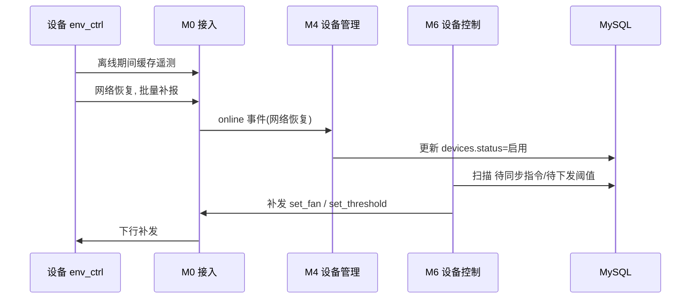

---

## 11. 跨模块交互总览（消息主干）

下图汇总"一次典型业务"在模块间的纵向调用主干，与 v2.0 第 6.4 节模块依赖图互为补充（该图看静态依赖，本图看动态调用顺序）。

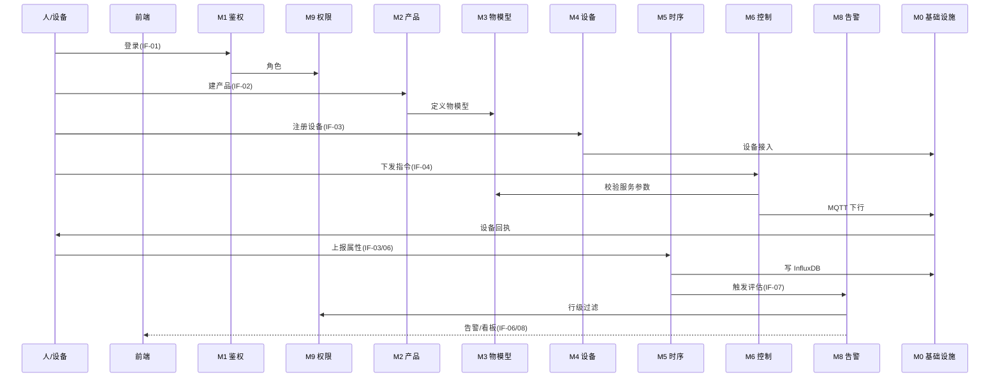

---

## 12. 与需求清单 v2.0 的追溯

| 交互流程 | 支撑的用例 | 支撑的模块 | 支撑的功能 | 关联需求 |
| --- | --- | --- | --- | --- |
| IF-01 认证与授权 | UC-G2/O1/A1/A4 | M1、M9 | F1、F9 | A-03 |
| IF-02 产品与物模型 | UC-A2、UC-A3 | M2、M3 | F2、F3 | A-01、A-02 |
| IF-03 设备接入上报 | UC-D1、UC-D2 | M0、M4、M5 | F4、F5 | P-01、P-02、P-07 |
| IF-04 控制闭环 | UC-G5、UC-D3 | M6、M3、M0 | F6 | P-03 |
| IF-05 阈值配置下发 | UC-G6、UC-D4 | M3、M8、M0 | F3、F8 | P-04 |
| IF-06 时序存储查询 | UC-G3、UC-G4 | M5、M0、M7 | F5、F7 | P-01、P-02、A-04 |
| IF-07 告警触发记录 | UC-D5、UC-G7 | M8、M5、M3 | F8 | P-04、P-05 |
| IF-08 权限拦截 | UC-O2、UC-G8 | M9、M1 | F9 | O-01、O-02、P-06 |
| IF-09 异常边界 | — | M0、M4、M6 | F4、F6 | 可靠性 |

**结论**：9 条交互流程覆盖 v2.0 全部 21 个用例（UC-G1~D5）与 9 个功能模块（F1–F9），并映射到 13 条干系人需求，形成「需求 → 用例 → 模块 → 交互流程」四级闭环追溯。

---

> 说明：本交互流程分析为**动态视角补充文档**，与 `需求清单2.0.md` 配套使用。进入详细设计阶段时，应依据本文的时序图进一步细化接口字段、状态机（device_commands 状态机、devices 启停状态机）与测试用例。
