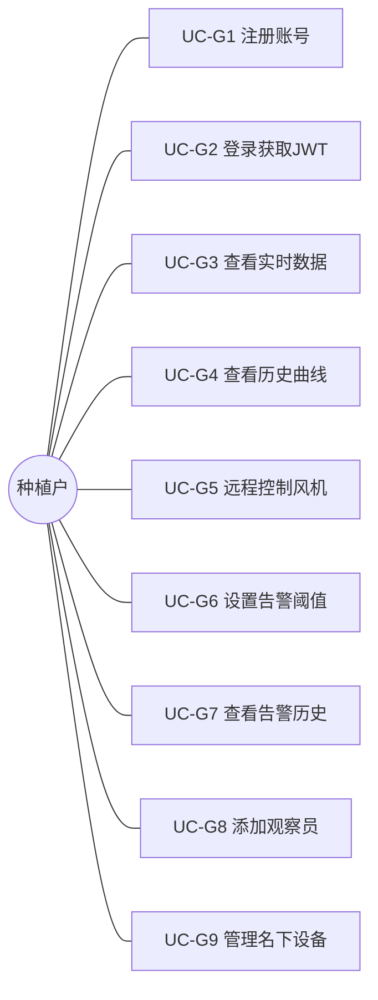
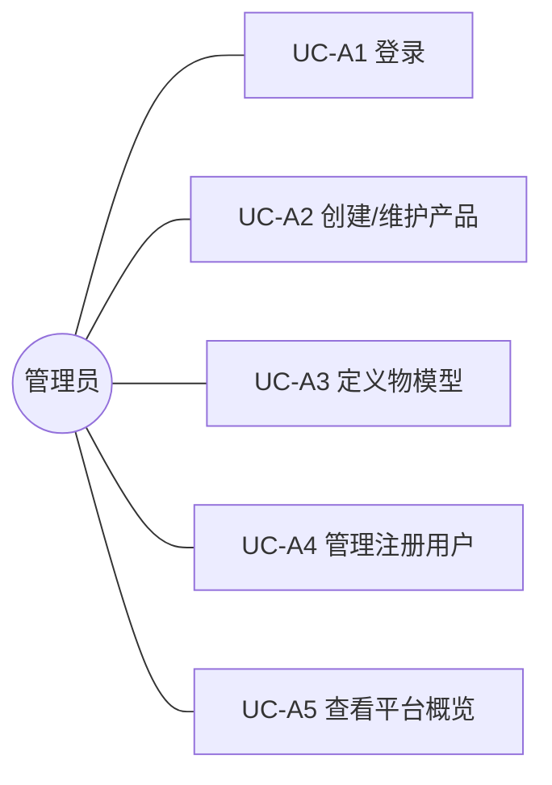
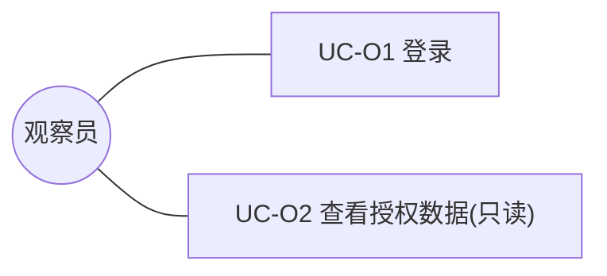
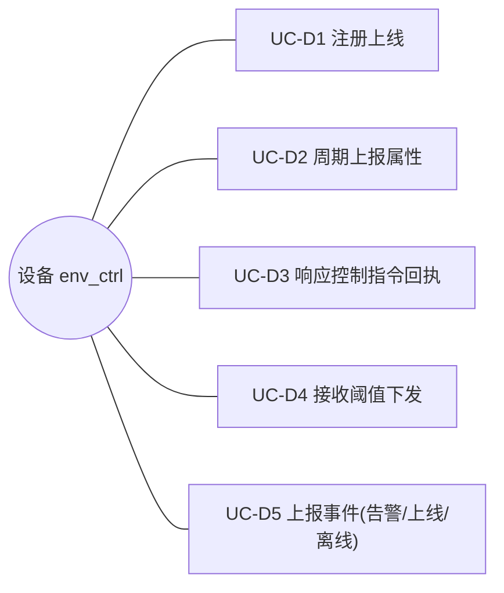
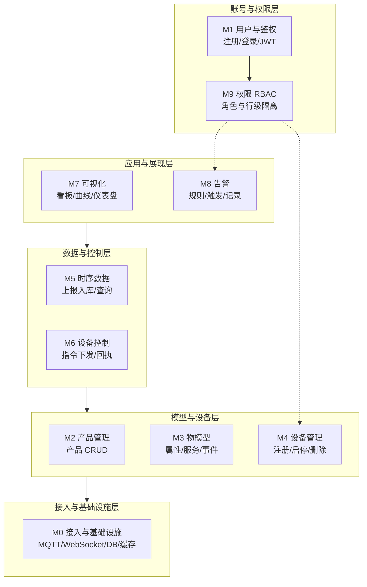
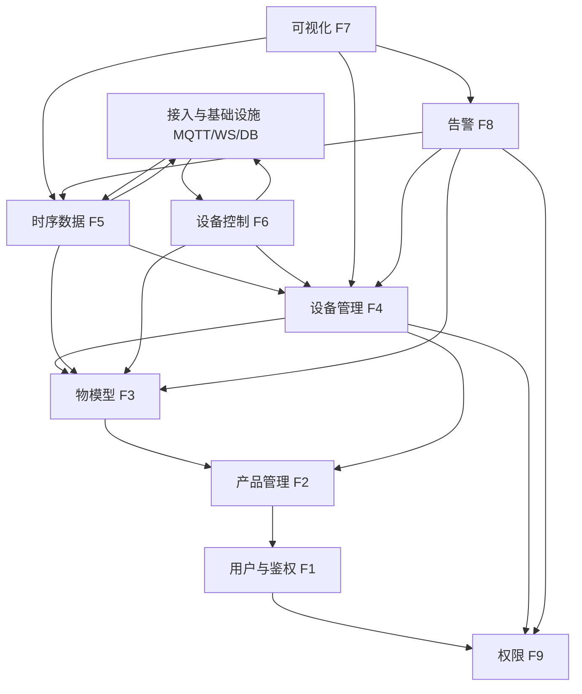

# 智慧农业环境监控平台 — 需求清单

| 项目 | 内容 |
| --- | --- |
| 文档名称 | 智慧农业环境监控平台需求清单 |
| 文档版本 | **v2.0（基线版 + 用例与模块分析）** |
| 编写日期 | 2026-09-09 |
| 文档状态 | 基线版，含用例分析与功能模块分析，已结合物模型设计完成需求追溯与冻结 |
| 适用范围 | 本科毕业设计 / 课程项目需求基线 |
| 替代文档 | `需求清单1.0.md`（v1.0）、`需求清单初稿.md`（v0.1，本版为权威基线） |

---

## 1. 修订说明（相对 v1.0）

| 变更项 | v1.0 | v2.0（本版） |
| --- | --- | --- |
| 用例分析 | 无 | **新增第 5 节**：参与者、用例清单、用例图、6 个典型用例规约（含主流程/异常流/前后置） |
| 功能模块分析 | 仅架构图 | **新增第 6 节**：模块划分、模块职责、模块依赖图、模块—用例追溯矩阵 |
| 需求追溯 | 干系人→功能 | 扩展为「干系人→用例→模块→功能」三级追溯 |
| 实现状态 | 功能清单内 | 同步更新至 v2.0 当前落地情况 |

> 说明：v2.0 在 v1.0 的需求基线之上，补强了**行为视角（用例）**与**结构视角（模块）**两层分析，使文档可直接支撑后续详细设计与任务拆解。

---

## 2. 项目背景与目标

### 2.1 背景
智慧农业通过物联网手段对温室、大棚、田间环境进行实时感知与自动化调控。本平台面向**环境监控**场景，采集温湿度、土壤墒情等数据，并提供设备接入、远程控制、数据可视化与告警能力，降低人工巡检成本，提升农业生产精细化管理水平。

首个落地产品为**智能环境测控仪（`env_ctrl`）**：集数据采集与设备控制于一体的农业物联网终端，部署于温室大棚、种植大田，具备"本地阈值判断 + 断网声光报警 + 联网补报"能力。

### 2.2 目标
构建一个可运行的物联网云平台，支持：
- 多产品 / 多设备的统一接入与生命周期管理；
- 基于"物模型"的设备能力抽象（属性 / 事件 / 服务）；
- 遥测时序数据的上报、存储与查询；
- 平台对设备的指令下发与回执闭环；
- 面向管理人员的可视化看板与阈值告警；
- 基于 JWT + RBAC 的账号与权限体系（含种植户 / 观察员 / 管理员三类角色）。

### 2.3 术语
| 术语 | 说明 |
| --- | --- |
| 产品（Product） | 一类设备的逻辑模板，含产品标识（ProductKey）与物模型 |
| 设备（Device） | 产品下的具体物理/虚拟终端，由 **ProductKey + DeviceName** 唯一标识 |
| 物模型（Thing Model） | 设备的数字孪生定义：属性、事件、服务 |
| 属性（Property） | 设备可读/可写的状态量（如温度、湿度、阈值） |
| 事件（Event） | 设备主动上报的信息（如告警、上线/下线） |
| 服务（Service） | 平台可调用的设备能力（如下发风扇开关、设置阈值） |
| 遥测（Telemetry） | 设备周期性上报的时序数据 |
| JWT | 无状态鉴权令牌 |

---

## 3. 干系人需求分析

### 3.1 角色与场景

| 角色 | 场景 | 关注点 |
| --- | --- | --- |
| 种植户 | 管理一个或多个大棚，需远程看数据、控设备、收告警 | 易用、实时、可协作 |
| 管理员 | 平台运营方，负责产品/物模型定义与用户秩序 | 可配置、可治理 |
| 观察员 | 种植户授权的协作者（亲属/技术员） | 只读、不误操作 |

### 3.2 种植户需求

| 编号 | 角色 | 需求描述 | 用户价值 | 对应功能模块 |
| --- | --- | --- | --- | --- |
| P-01 | 种植户 | 在手机上随时看到每个大棚的温度和土壤湿度 | 不用来回跑大棚看温度计 | 数据查看 / F5、F7 |
| P-02 | 种植户 | 查看过去一段时间温度和湿度的变化曲线 | 了解环境变化规律，提前采取措施 | 数据可视化 / F5、F7 |
| P-03 | 种植户 | 在手机上远程打开或关闭大棚设备（如风机） | 夏天不用跑大棚，晚上忘关可远程关 | 设备控制 / F6 |
| P-04 | 种植户 | 自己设定温度或土壤湿度的告警阈值 | 不用一直盯着手机，异常时自动提醒 | 告警管理 / F3、F8 |
| P-05 | 种植户 | 查看过去发生过哪些告警及处理状态 | 回顾异常情况，总结经验 | 告警管理 / F8 |
| P-06 | 种植户 | 添加观察员协作者查看大棚数据 | 忙不过来或外出时有人帮忙盯着 | 权限管理 / F9 |
| P-07 | 种植户 | 给设备起名、标注位置，不用的可停用或删除 | 设备多了不乱，知道哪个在哪个棚 | 设备管理 / F4 |

### 3.3 管理员需求

| 编号 | 角色 | 需求描述 | 用户价值 | 对应功能模块 |
| --- | --- | --- | --- | --- |
| A-01 | 管理员 | 在平台上创建设备产品，供种植户注册时选择 | 种植户买设备后能完成注册上线 | 产品管理 / F2 |
| A-02 | 管理员 | 为产品定义上报属性、支持服务和上报事件 | 平台能解析数据、展示控制、处理告警 | 物模型 / F3 |
| A-03 | 管理员 | 查看和管理平台所有注册用户 | 维护平台秩序，必要时冻结账号 | 用户管理 / F1、F9 |
| A-04 | 管理员 | 查看平台设备总数、在线数、今日告警数 | 掌握平台整体运行状况 | 系统概览 / F7（管理员看板） |

### 3.4 观察员需求

| 编号 | 角色 | 需求描述 | 用户价值 | 对应功能模块 |
| --- | --- | --- | --- | --- |
| O-01 | 观察员 | 登录平台查看种植户授权的大棚数据 | 帮亲戚盯着大棚，有问题及时提醒 | 数据查看 / F5、F7、F9 |
| O-02 | 观察员 | 只能查看数据，不能操作控制设备 | 避免误操作关错设备 | 权限控制 / F9 |

---

## 4. 总体功能清单

| 编号 | 模块 | 功能 | 优先级 | 需求来源 | 核心说明 | 依赖 | 实现状态 |
| --- | --- | --- | --- | --- | --- | --- | --- |
| F1 | 用户管理 | 注册 / 登录 | 高 | A-03 | 注册、登录获取 JWT | — | ✅ 已实现（注册/登录/JWT） |
| F2 | 产品管理 | 产品 CRUD | 高 | A-01 | 创建产品（名称、产品标识 `env_ctrl`） | F1 | ✅ 已实现（CRUD） |
| F3 | 物模型 | 属性 / 事件 / 服务定义 | 高 | A-02, P-01~P-04 | 定义 `env_ctrl` 6 属性 / 2 服务 / 4 事件 | F2 | ✅ 已实现（嵌套 CRUD + 聚合） |
| F4 | 设备管理 | 设备注册 / 启停 / 删除 | 高 | P-07 | 设备生命周期管理（ProductKey+DeviceName） | F2、F3 | ⬜ 表已建，接口未实现 |
| F5 | 时序数据 | 上报入库 / 查询 | 高 | P-01、P-02 | 遥测数据写入 InfluxDB | F4 | ⬜ 未实现 |
| F6 | 设备控制 | 指令下发 / 回执 | 中 | P-03 | 平台下发开关指令（set_fan） | F3、F4 | ⬜ 表已建，接口未实现 |
| F7 | 可视化 | 看板 / 曲线 / 仪表盘 | 中 | P-02、A-04 | ECharts 展示 | F5 | ⬜ 未实现 |
| F8 | 告警 | 规则 / 触发 / 记录 | 中 | P-04、P-05 | 阈值告警引擎（规则独立表） | F5 | 🟡 规则表已建，引擎未实现 |
| F9 | 权限 | RBAC 拦截 | 中 | P-06、O-02 | 角色权限控制（种植户/观察员/管理员） | F1 | ⬜ 仅 JWT，无 RBAC 拦截 |

---

## 5. 用例分析

> 从**行为视角**刻画系统如何被各类参与者使用，作为功能模块划分与接口设计的基础。

### 5.1 参与者（Actor）

| 参与者 | 类型 | 说明 |
| --- | --- | --- |
| 种植户 | 主参与者（人） | 使用平台看数据、控设备、收告警的终端用户 |
| 观察员 | 主参与者（人） | 被种植户授权的只读协作者 |
| 管理员 | 主参与者（人） | 平台运营，负责产品/物模型/用户治理 |
| 设备（env_ctrl） | 辅助参与者（外部系统） | 上报数据、响应指令、上报事件；IoT 场景下作为与系统交互的外部实体，是规范的次要参与者 |

> 注：「平台」是**待设计的系统本身**，不属于系统之外的交互角色，因此**不作为用例参与者**。原图（v2.0 早期版本）中指向平台的虚线属于系统内部数据流，已移至 6.4 模块依赖图表达。

### 5.2 用例清单

| 用例编号 | 用例名称 | 参与者 | 功能模块 | 需求来源 | 简述 |
| --- | --- | --- | --- | --- | --- |
| UC-G1 | 注册账号 | 种植户 | F1 | — | 填写用户名/密码注册 |
| UC-G2 | 登录并获取 JWT | 种植户 | F1 | A-03 | 账号密码登录，获取 access/refresh token |
| UC-G3 | 查看设备实时数据 | 种植户 | F5/F7 | P-01 | 查看名下设备当前温湿度等 |
| UC-G4 | 查看历史曲线 | 种植户 | F5/F7 | P-02 | 按时间范围查看变化曲线 |
| UC-G5 | 远程控制设备（开关风机） | 种植户 | F6 | P-03 | 下发 set_fan 并确认回执 |
| UC-G6 | 设置告警阈值 | 种植户 | F3/F8 | P-04 | 改 temp_threshold/humid_threshold 或调用 set_threshold |
| UC-G7 | 查看告警历史 | 种植户 | F8 | P-05 | 查询本人设备告警流水 |
| UC-G8 | 添加观察员协作者 | 种植户 | F9 | P-06 | 授权观察员只读本人数据 |
| UC-G9 | 管理名下设备（命名/位置/启停/删除） | 种植户 | F4 | P-07 | 设备生命周期维护 |
| UC-O1 | 登录 | 观察员 | F1 | O-01 | 与 UC-G2 同流程，角色受限 |
| UC-O2 | 查看授权设备数据（只读） | 观察员 | F5/F7/F9 | O-01,O-02 | 仅读被授权数据，无控制入口 |
| UC-A1 | 登录 | 管理员 | F1 | A-03 | 与 UC-G2 同流程，角色为管理员 |
| UC-A2 | 创建/维护产品 | 管理员 | F2 | A-01 | 产品 CRUD |
| UC-A3 | 定义物模型（属性/服务/事件） | 管理员 | F3 | A-02 | 物模型嵌套 CRUD + 聚合 |
| UC-A4 | 管理注册用户（查看/冻结） | 管理员 | F1/F9 | A-03 | 用户治理 |
| UC-A5 | 查看平台概览（设备/在线/告警） | 管理员 | F7 | A-04 | 管理员统计看板 |
| UC-D1 | 设备注册上线 | 设备 | F4 | — | 连接 MQTT，平台感知 online 事件 |
| UC-D2 | 周期上报属性 | 设备 | F5 | P-01,P-02 | 上报 air_temperature 等属性 |
| UC-D3 | 响应控制指令并回执 | 设备 | F6 | P-03 | 执行 set_fan，回执 messageId |
| UC-D4 | 接收阈值下发 | 设备 | F3 | P-04 | 接收 set_threshold，本地存储 |
| UC-D5 | 上报事件（告警/上线/下线） | 设备/平台 | F8 | P-04,P-05 | 上报 temp_alarm/dry_alarm/online/offline |

### 5.3 用例图

> 按参与者拆分绘制，避免单一大图过宽难以阅读。实线表示「参与者—用例」关联；各角色的登录用例（UC-O1/UC-A1）与种植户登录（UC-G2）流程一致，可视为同一鉴权能力的不同角色入口（`<<extend>>`）。

#### 5.3.1 种植户用例图



#### 5.3.2 管理员用例图



#### 5.3.3 观察员用例图



#### 5.3.4 设备（env_ctrl）用例图



> 说明：
> - **「平台」不再作为参与者**。平台是待设计的系统本身，用例图只刻画系统"之外"与其交互的角色；原图指向平台的虚线（JWT/物模型/遥测）属于系统内部数据流，已移至 6.4 模块依赖图。
> - **设备（env_ctrl）保留为外部系统/次要参与者**，这是 IoT 场景下的规范做法——它主动向系统上报数据、接收指令并回执，是与平台交互的真实外部实体。
> - 需要总览时，可在 draw.io / PlantUML 中将上述 4 张图合并；或用 `<<extend>>` 表达各角色登录对 UC-G2 的复用。

### 5.4 典型用例规约

#### UC-G2 登录并获取 JWT
| 项 | 内容 |
| --- | --- |
| 参与者 | 种植户 / 观察员 / 管理员 |
| 简述 | 用户输入账号密码，系统校验后签发 JWT |
| 前置条件 | 用户已注册；账号未被冻结 |
| 基本流程 | 1. 用户输入账号、密码；2. 系统校验凭据；3. 生成 access/refresh token；4. 返回 token 与用户信息 |
| 异常流程 | 2a. 凭据错误 → 返回 401，提示错误；2b. 账号被冻结 → 返回 403，提示联系管理员；3a. token 生成失败 → 返回 500 |
| 后置条件 | 客户端持有有效 accessToken，可访问受保护接口 |
| 特殊需求 | accessToken 2h，refreshToken 7d；连续失败 5 次临时锁定 |

#### UC-A2 创建产品
| 项 | 内容 |
| --- | --- |
| 参与者 | 管理员 |
| 简述 | 管理员创建一类设备产品（如 env_ctrl） |
| 前置条件 | 管理员已登录（UC-A1） |
| 基本流程 | 1. 进入产品管理；2. 填写名称、产品标识、描述；3. 提交；4. 系统生成 productKey（若未自定义）并持久化；5. 返回产品详情 |
| 异常流程 | 2a. productKey 重复 → 返回 409；3a. 必填缺失 → 返回 400 |
| 后置条件 | 产品存在于 `products` 表，可被设备注册（F4）与物模型定义（F3）引用 |
| 特殊需求 | productKey 全局唯一；支持 thing_model JSON 一次写入 |

#### UC-A3 定义物模型
| 项 | 内容 |
| --- | --- |
| 参与者 | 管理员 |
| 简述 | 为产品定义属性/服务/事件 |
| 前置条件 | 产品已存在（UC-A2） |
| 基本流程 | 1. 选择产品；2. 添加属性（标识符/类型/读写/单位）；3. 添加服务（输入/输出参数）；4. 添加事件（触发位置/输出参数）；5. 保存；6. 同步写入 thing_model JSON 与关系表 |
| 异常流程 | 2a. 标识符重复 → 返回 409；4a. 参数结构非法 → 返回 400 |
| 后置条件 | 物模型可被设备接入（F4）、控制（F6）、可视化（F7）引用；JSON 与关系表一致 |
| 特殊需求 | 同一产品内 identifier 唯一；读写属性区分；JSON+关系表双写一致 |

#### UC-G9 注册设备
| 项 | 内容 |
| --- | --- |
| 参与者 | 种植户（管理员亦可） |
| 简述 | 在产品下创建设备实例并获取密钥 |
| 前置条件 | 产品已存在（UC-A2）；用户已登录（UC-G2） |
| 基本流程 | 1. 选择产品；2. 填写设备名、位置、描述；3. 提交；4. 系统生成 DeviceName + deviceSecret；5. 返回设备凭证（密钥仅此一次明文） |
| 异常流程 | 2a. DeviceName 重复 → 返回 409；3a. 产品不存在 → 返回 404 |
| 后置条件 | 设备存在于 `devices` 表，状态=启用，可上报（UC-D2）/接收指令（UC-D3） |
| 特殊需求 | 设备由 ProductKey + DeviceName 唯一标识；停用后拒收数据/指令 |

#### UC-G5 远程控制设备（开关风机）
| 项 | 内容 |
| --- | --- |
| 参与者 | 种植户 |
| 简述 | 下发 set_fan 指令并确认回执 |
| 前置条件 | 设备已注册启用（UC-G9）；用户已登录（UC-G2） |
| 基本流程 | 1. 用户在界面点击"开/关风机"；2. 平台按物模型服务 set_fan 组装参数；3. 经 MQTT 下行推送；4. 设备执行并上行回执（messageId）；5. 平台更新指令状态=成功；6. 界面反馈 fan_status |
| 异常流程 | 3a. 设备离线 → 指令排队/标记失败；4a. 超时 10s 无回执 → 标记失败，可限次重试 |
| 后置条件 | 指令状态落 `device_commands`；fan_status 更新 |
| 特殊需求 | 每条指令唯一 messageId；仅启用设备可接收 |

#### UC-G6 配置告警阈值
| 项 | 内容 |
| --- | --- |
| 参与者 | 种植户 |
| 简述 | 设定温/湿度告警阈值（属性读写或服务批量） |
| 前置条件 | 产品物模型含 temp_threshold/humid_threshold（UC-A3）；用户已登录 |
| 基本流程 | 1. 用户填写温度/湿度阈值；2. 平台写入属性（或调用 set_threshold 服务）；3. 下发到设备本地存储；4. 返回成功 |
| 异常流程 | 2a. 阈值越界 → 返回 400；3a. 设备离线 → 标记待同步，联网后补发 |
| 后置条件 | 阈值持久化于 `device_property_values` 与设备本地；告警规则可引用 |
| 特殊需求 | 断网时设备端仍按本地阈值判断并声光报警（P-04） |

---

## 6. 功能模块分析

> 从**结构视角**刻画系统由哪些模块组成、各自职责与依赖关系，支撑详细设计与编码分工。

### 6.1 系统模块划分

| 模块编号 | 模块名称 | 对应功能 | 说明 |
| --- | --- | --- | --- |
| M0 | 接入与基础设施 | — | MQTT 桥接、WebSocket、网关、DB/缓存 |
| M1 | 用户与鉴权模块 | F1 | 注册/登录/JWT 签发 |
| M2 | 产品管理模块 | F2 | 产品 CRUD |
| M3 | 物模型模块 | F3 | 属性/服务/事件 CRUD + 聚合 |
| M4 | 设备管理模块 | F4 | 设备注册/启停/删除 |
| M5 | 时序数据模块 | F5 | 上报入库/查询 |
| M6 | 设备控制模块 | F6 | 指令下发/回执 |
| M7 | 可视化模块 | F7 | 看板/曲线/仪表盘 |
| M8 | 告警模块 | F8 | 规则/触发/记录 |
| M9 | 权限模块 | F9 | RBAC 角色/行级隔离 |

### 6.2 功能模块图

> 从**分层视角**展示系统 10 个模块（M0–M9）的逻辑归属与调用方向；细粒度模块间依赖见 6.4。



> 说明：自上而下为「应用层 → 数据控制层 → 模型设备层 → 基础设施层」的调用方向；M9 权限为横切模块，被设备管理（M4）、告警（M8）复用（虚线），并为用户鉴权（M1）提供角色支撑。

### 6.3 模块职责说明

| 模块 | 职责 | 关键接口（内部） | 依赖 |
| --- | --- | --- | --- |
| M1 用户与鉴权 | 账号生命周期、JWT 签发/刷新、密码哈希 | `POST /api/auth/*` | M9（角色） |
| M2 产品管理 | 产品 CRUD、productKey 生成、thing_model 写入 | `GET/POST/PUT/DELETE /api/products` | M1 |
| M3 物模型 | 属性/服务/事件 CRUD、thing-model 聚合、JSON+关系表双写 | `/api/products/{id}/properties\|services\|events` | M2 |
| M4 设备管理 | 设备注册、密钥分发、启停、删除 | `/api/devices` | M2、M3、M9 |
| M5 时序数据 | 消费 MQTT 上报、写入 InfluxDB、REST 查询 | MQTT 主题、 `GET /api/telemetry` | M4、M0、M3 |
| M6 设备控制 | 指令组装下发、回执关联、状态更新 | `POST /api/devices/{id}/commands` | M4、M3、M0 |
| M7 可视化 | 实时看板、历史曲线、概览统计 | 前端 + WebSocket 订阅 | M5、M8、M4 |
| M8 告警 | 规则 CRUD、阈值评估引擎、告警流水 | `/api/alarm-rules`、`/api/alerts` | M5、M3、M4、M9 |
| M9 权限 | 角色定义、JWT 角色校验、行级隔离 | 鉴权中间件 | M1 |
| M0 基础设施 | EMQX 桥接、SocketIO、MySQL/InfluxDB/Redis | — | — |

### 6.4 模块依赖与交互



> 依赖方向为「上层模块依赖下层模块」；M0 为横切基础设施，被 F5/F6 直接消费。权限模块 M9 被 M1/M4/M8 复用。

### 6.5 模块—用例追溯矩阵

| 模块 | 负责用例 |
| --- | --- |
| M1 用户与鉴权 | UC-G1、UC-G2、UC-O1、UC-A1、UC-A4 |
| M2 产品管理 | UC-A2 |
| M3 物模型 | UC-A3、UC-G6（属性侧）、UC-D4 |
| M4 设备管理 | UC-G9、UC-D1 |
| M5 时序数据 | UC-G3、UC-G4、UC-D2 |
| M6 设备控制 | UC-G5、UC-D3 |
| M7 可视化 | UC-A5（部分） |
| M8 告警 | UC-G7、UC-D5 |
| M9 权限 | UC-O2、UC-G8（授权） |

---

## 7. 详细功能需求

### F1 用户管理 — 注册 / 登录
- **功能描述**：提供用户注册与登录能力，登录成功后返回 JWT（access + refresh），用于后续所有接口鉴权。支持三类角色（种植户 / 观察员 / 管理员）。
- **用例**：UC-G1、UC-G2（种植户）；UC-O1（观察员）；UC-A1、UC-A4（管理员）。
- **输入 / 输出**：注册 `{username|email, password, role?}` → `{userId, username, role}`；登录 `{account, password}` → `{accessToken, refreshToken, expiresIn, userInfo}`。
- **业务规则**：用户名/邮箱全局唯一；密码加盐哈希；accessToken 2h、refreshToken 7d；角色默认种植户，管理员后台分配。
- **接口建议（已实现）**：`POST /api/auth/register`、`POST /api/auth/login`、`GET /api/auth/me`。
- **验收标准**：注册/登录获取 JWT；错误密码拒绝；refresh 续期；无 token 返回 401。

### F2 产品管理 — 产品 CRUD
- **功能描述**：产品是设备的逻辑分组模板，承载产品标识（ProductKey）与物模型；首个产品为 `env_ctrl` 智能环境测控仪。
- **用例**：UC-A2。
- **输入 / 输出**：创建 `{name, product_key?, description?, thing_model?}` → `{productId, productKey, ...}`；列表（分页+关键字）/详情/更新/删除标准 CRUD。
- **业务规则**：`productKey` 全局唯一；产品表同时保存 `thing_model` JSON 与关系表关键字段；删除产品级联清理物模型关系表。
- **接口建议（已实现）**：`/api/products`（GET/POST/PUT/DELETE）。
- **验收标准**：增删改查可用；重复 productKey 拒绝；列表分页；删除级联清理。

### F3 物模型 — 属性 / 事件 / 服务定义
- **功能描述**：为产品定义数字孪生能力：属性、事件、服务。首个产品 `env_ctrl` 物模型（第 8 节）已冻结。
- **用例**：UC-A3、UC-G6、UC-D4。
- **数据结构**：属性 `{identifier, name, dataType, access_mode, unit, min, max}`；事件 `{identifier, name, trigger, outputParams[]}`；服务 `{identifier, name, inputParams[], outputParams[]}`。
- **业务规则**：identifier 同产品内唯一；属性区分只读/读写；服务定义决定 F6 指令参数结构；JSON+关系表双写一致。
- **接口建议（已实现）**：`/api/products/{id}/properties|services|events`（CRUD）+ `GET /api/products/{id}/thing-model`（聚合）。
- **验收标准**：可维护 env_ctrl 的 6 属性/2 服务/4 事件；被 F4/F6/F7 正确引用。

### F4 设备管理 — 注册 / 启停 / 删除
- **功能描述**：管理设备全生命周期；设备由 ProductKey + DeviceName 唯一标识。
- **用例**：UC-G9、UC-D1。
- **输入 / 输出**：注册 `{deviceName, productId, location?, description?}` → `{deviceId, deviceName, deviceSecret, status}`。
- **业务规则**：密钥仅注册时明文返回一次；停用设备拒收遥测与指令；删除需二次确认。
- **接口建议**：`/api/devices`（GET/POST/PUT/DELETE）、`POST /api/devices/{id}/enable|disable`。
- **验收标准**：设备与产品关联；停用后不收数据/指令；列表可筛选状态与位置。

### F5 时序数据 — 上报入库 / 查询
- **功能描述**：设备经 MQTT 上报遥测，平台解析写入 InfluxDB，并提供查询。
- **用例**：UC-G3、UC-G4、UC-D2。
- **输入 / 输出**：上报 `{ts, properties:{air_temperature, air_humidity, soil_humidity, fan_status}}`；查询 `GET /api/telemetry?deviceId=&metric=&from=&to=` → 时序点数组。
- **存储设计**：InfluxDB `measurement`=productKey，`tag`=deviceName，`field`=各指标。
- **业务规则**：仅启用合法设备可写入；校验 ProductKey/DeviceSecret；热数据 30 天。
- **接口建议**：MQTT 桥接消费 + REST 查询。
- **验收标准**：实时写入；按设备+时间查询正确；近时效查询 < 1s。

### F6 设备控制 — 指令下发 / 回执
- **功能描述**：基于物模型"服务"下发指令（如 set_fan），设备回执闭环。
- **用例**：UC-G5、UC-D3。
- **流程**：1. 调用 `POST /api/devices/{id}/commands` 组装 set_fan；2. MQTT 下行；3. 设备回执 messageId；4. 更新指令状态。
- **业务规则**：唯一 messageId 关联回执；超时 10s 记失败可重试；仅启用设备可接收。
- **接口建议**：`POST /api/devices/{id}/commands`、`GET /api/devices/{id}/commands/{msgId}`。
- **验收标准**：指令可达并回执；离线/超时有记录与状态。

### F7 可视化 — 看板 / 曲线 / 仪表盘
- **功能描述**：前端基于 ECharts 展示实时看板、历史曲线、仪表盘；管理员额外可见平台级概览（A-04）。
- **用例**：UC-G3、UC-G4、UC-A5。
- **输入 / 输出**：设备选择、时间范围、刷新频率 → 折线图/仪表盘/数字卡片/概览卡。
- **技术建议**：Vue3 + ECharts；WebSocket 订阅最新值；历史调 F5；概览调统计聚合。
- **验收标准**：图表正确渲染；实时刷新；多设备可切换；管理员概览准确。

### F8 告警 — 规则 / 触发 / 记录
- **功能描述**：阈值告警引擎，规则独立建表 `alarm_rules`；越限触发落 `device_events`。
- **用例**：UC-G7、UC-D5。
- **输入 / 输出**：规则 `{product_id, device_id, rule_name, metric, operator, threshold, level, enabled, description}`；记录 `{ruleId, deviceId, value, triggeredAt, level, status}`。
- **业务规则**：规则绑定产品/设备；支持防抖时长；触发至少"记录+界面提示"。
- **接口建议**：`/api/alarm-rules`（CRUD）、`/api/alerts`（查询）。
- **验收标准**：规则可配；越限正确触发落库；历史可按设备/时间查。
- **已建示例规则**：`air_temperature > 35`；`soil_humidity < 20`。

### F9 权限 — RBAC 拦截
- **功能描述**：基于角色访问控制，区分种植户/观察员/管理员，行级隔离。
- **用例**：UC-O2、UC-G8、UC-A4。
- **模型**：用户—角色—权限；JWT 携带 userId 与 roles。
- **权限项**：`product:manage`、`device:control`、`alert:config`、`user:admin`、`device:view_shared`。
- **业务规则**：公开接口免鉴权；数据级行级隔离；默认预置三角色。
- **接口建议**：鉴权中间件统一拦截。
- **验收标准**：未登录 401；越权 403；角色数据范围正确。

---

## 8. 物模型定义（首个产品 `env_ctrl`）

### 8.1 产品与设备的关系
- **产品（Product）**：设备的逻辑模板（如"智能环境测控仪"车型）。
- **设备（Device）**：产品的具体实例，通过 **ProductKey + DeviceName** 唯一标识（类比"车牌"）。

### 8.2 物模型三要素

| 要素 | 数据的流动方向 | 谁发起 | 例 |
| --- | --- | --- | --- |
| 属性 | 设备 → 平台 | 设备主动上报 | 温度、湿度、开关状态 |
| 服务 | 平台 → 设备 | 平台主动调用 | 打开开关、设置阈值 |
| 事件 | 设备 → 平台 | 设备检测到异常主动上报 | 超温告警、设备上线 |

### 8.3 产品定义

| 项目 | 内容 |
| --- | --- |
| 产品名称 | 智能环境测控仪 |
| 产品标识 | `env_ctrl` |
| 产品定位 | 集数据采集与设备控制于一体的农业物联网终端 |
| 部署位置 | 温室大棚、种植大田 |

### 8.4 属性（6 条）

| 序号 | 属性名称 | 标识符 | 数据类型 | 单位 | 读写类型 | 说明 |
| --- | --- | --- | --- | --- | --- | --- |
| 1 | 空气温度 | `air_temperature` | float | °C | 只读 | 传感器采集上报 |
| 2 | 空气湿度 | `air_humidity` | float | %RH | 只读 | 传感器采集上报 |
| 3 | 土壤湿度 | `soil_humidity` | float | % | 只读 | 传感器采集上报 |
| 4 | 风机状态 | `fan_status` | bool | - | 只读 | true=运转，false=停止 |
| 5 | 温度告警阈值 | `temp_threshold` | float | °C | 读写 | 用户设定，设备本地存储 |
| 6 | 湿度告警阈值 | `humid_threshold` | float | % | 读写 | 用户设定，设备本地存储 |

### 8.5 服务（2 条）

| 序号 | 服务名称 | 标识符 | 输入参数 | 输出参数 | 说明 |
| --- | --- | --- | --- | --- | --- |
| 1 | 风机控制 | `set_fan` | `fan_state`（bool，必填） | `result`（string） | true=开，false=关 |
| 2 | 设置告警阈值 | `set_threshold` | `temp_max`（float）、`humid_min`（float） | `result`（string） | 批量设置两个告警线 |

### 8.6 事件（4 条）

| 序号 | 事件名称 | 标识符 | 触发位置 | 输出参数 | 触发条件 |
| --- | --- | --- | --- | --- | --- |
| 1 | 温度超限告警 | `temp_alarm` | 设备端 | `temperature`、`threshold`、`timestamp` | 温度 > 本地存储阈值 |
| 2 | 土壤湿度低告警 | `dry_alarm` | 设备端 | `humidity`、`threshold`、`timestamp` | 湿度 < 本地存储阈值 |
| 3 | 设备上线 | `online` | 平台 | `timestamp` | 设备连接成功，平台感知 |
| 4 | 设备下线 | `offline` | 平台 | `timestamp` | 心跳超时，平台感知 |

---

## 9. 需求追溯验证

| 需求编号 | 角色 | 需求描述 | 被什么满足 | 验证 |
| --- | --- | --- | --- | --- |
| P-01 | 种植户 | 看温度和土壤湿度 | F5/F7 + 属性 `air_temperature`、`soil_humidity` | ✅ |
| P-02 | 种植户 | 看温湿度变化曲线 | F5/F7 + 属性 `air_temperature`、`air_humidity` + 时序存储 | ✅ |
| P-03 | 种植户 | 远程开/关风机 | F6 + 服务 `set_fan` + 属性 `fan_status` | ✅ |
| P-04 | 种植户 | 设定告警阈值 | F3/F8 + 属性(读写) `temp_threshold`、`humid_threshold` + 服务 `set_threshold` + 事件 `temp_alarm`、`dry_alarm` | ✅ |
| P-05 | 种植户 | 查看告警历史 | F8 + 事件持久化存储 | ✅ |
| P-06 | 种植户 | 添加观察员 | F9 + 角色/授权 | ✅ |
| P-07 | 种植户 | 设备起名/位置/停用 | F4 设备管理 | ✅ |
| A-01 | 管理员 | 创建产品 | F2 产品管理 | ✅ |
| A-02 | 管理员 | 定义属性/服务/事件 | F3 完整物模型 | ✅ |
| A-03 | 管理员 | 管理用户 | F1/F9 用户与权限 | ✅ |
| A-04 | 管理员 | 平台统计概览 | F7 管理员看板 | ✅ |
| O-01 | 观察员 | 查看授权数据 | F5/F7/F9 授权只读 | ✅ |
| O-02 | 观察员 | 只查看不操作 | F9 角色拦截 | ✅ |

**结论**：13 条干系人需求全部被 F1–F9 功能、物模型与用例覆盖，无遗漏。

---

## 10. 数据模型设计决策

### 10.1 物模型双轨存储
- **`products.thing_model`（JSON 列）**：存完整物模型，前端一次加载。
- **关系表 `product_properties` / `product_services` / `product_events`**：存关键字段供 SQL 查询、运维统计、管理界面。
- **一致性**：更新物模型时同步维护 JSON 与关系表（建议统一服务层封装）。

### 10.2 告警规则独立建表
- **`alarm_rules`** 独立：告警规则是"用户配置的阈值实例"，与物模型（设备能力定义）解耦。
- 字段：`product_id`、`device_id`（NULL=产品级）、`rule_name`、`metric`、`operator`、`threshold`、`level`、`enabled`、`description`。
- 与 `device_events`（触发流水）分离。

### 10.3 已落地表清单（MySQL `iotcloud`）
`products`（含 `thing_model` JSON）、`devices`、`product_properties`、`product_services`、`product_events`、`device_property_values`、`device_commands`、`device_events`、`alarm_rules`。见 `db/init_iotcloud.sql`。

---

## 11. 非功能性需求

| 类别 | 需求 |
| --- | --- |
| 性能 | ≥ 1000 台设备并发接入；时序写入 ≥ 500 点/秒；近 24h 查询 < 1s |
| 安全 | 全站 HTTPS；JWT 鉴权；密码加盐哈希；设备密钥不明文落库；RBAC 行级隔离 |
| 可靠性 | 关键服务可水平扩展；MQTT Broker 集群化；写入重试与削峰 |
| 可用性 | 平台可用性 ≥ 99.5% |
| 可维护性 | 统一日志、OpenAPI 文档、基础监控（QPS/写入延迟/设备在线数） |
| 兼容性 | MQTT 3.1.1/5.0；主流浏览器；移动端自适应 |
| 可扩展性 | 物模型驱动，新增设备类型无需改代码；存储按产品分桶 |

---

## 12. 技术架构建议（参考）

```
设备(env_ctrl) ── MQTT(TLS) ──▶ EMQX ──桥接──▶ 后端(Flask: M1~M9)
                                          │
        ┌─────────────────────────────────┼─────────────────────────┐
        ▼                                 ▼                         ▼
    MySQL(产品/设备/物模型/        InfluxDB(时序)            Redis(缓存/Session)
    用户/权限/告警规则)            air_temperature/...         │
        │                                                   │
    前端(Vue3+ECharts) ◀── REST / WebSocket(SocketIO) ──────┘
```

- **后端**：Python + Flask（已落地 F1/F2/F3 骨架与 CRUD）；`Flask-JWT-Extended`、`Flask-SQLAlchemy`+`PyMySQL`、`paho-mqtt`、`Flask-SocketIO`、`Flask-Caching`/Redis、`Flask-CORS`。
- **消息**：EMQX；**存储**：MySQL + InfluxDB + Redis；**前端**：Vue3 + ECharts；**部署**：Docker / Docker Compose。

---

## 13. 范围、里程碑与实现状态

- **一期（核心）**：F1 ✅、F2 ✅、F3 ✅、F4（表已建）、F5、F9
- **二期（增强）**：F6（表已建）、F7、F8（规则表已建）

| 编号 | 功能 | 状态 |
| --- | --- | --- |
| F1 | 用户注册/登录/JWT | ✅ 已实现并端到端验证 |
| F2 | 产品 CRUD | ✅ 已实现并端到端验证 |
| F3 | 物模型 CRUD + 聚合 | ✅ 已实现并端到端验证 |
| F4 | 设备管理 | ⬜ 接口未实现（`devices` 表已建） |
| F5 | 时序数据 | ⬜ 未实现 |
| F6 | 设备控制 | ⬜ 接口未实现（`device_commands` 表已建） |
| F7 | 可视化 | ⬜ 未实现 |
| F8 | 告警规则/引擎 | 🟡 规则表与示例已建，触发引擎未实现 |
| F9 | RBAC 权限 | ⬜ 仅 JWT，无角色拦截 |

---

## 14. 风险与待确认事项

1. 设备侧协议：MQTT / CoAP / HTTP；是否兼容 Modbus 网关。
2. 数据保留策略：时序热/冷分层与归档周期。
3. 部署环境：本地/云/自建（当前元数据库 `10.3.7.251:3306`）。
4. 多租户：初版单租户，是否需隔离待确认。
5. 告警动作：初版"记录+界面提示"，是否接短信/邮件/微信。
6. 物模型双写一致性：JSON 与关系表同步机制需明确。
7. 观察员授权模型：P-06 需定义授权关系表（用户—设备/产品授权），本版暂未细化。
8. 用例落地：M4/M5/M6/M7/M8/M9 对应接口尚未实现，需在详细设计中完成用例到接口的映射。

---

> 说明：本版（v2.0）为**需求基线 + 用例与模块分析**，物模型 `env_ctrl` 已冻结。后续进入详细设计时应依据本版完成接口字段、状态机、数据字典与测试用例设计。
